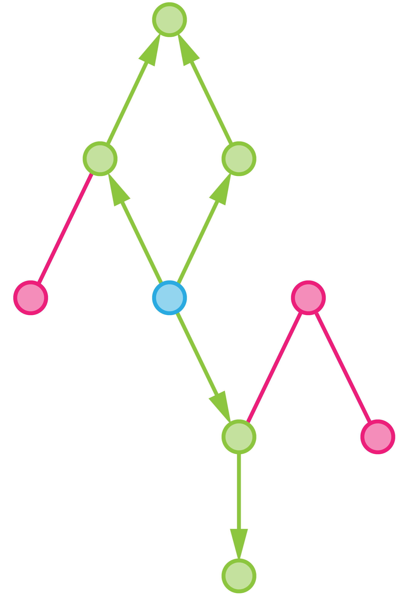

# Event

[]()
[]()
[]()

*Event* is a graph-based event bus with subscriber priority sorting.



The basic building blocks of the event bus are the so-called *Event Scopes*. 
An event scope provides the functionality to post events as well as to listen to specific events based on their type.

A structured event bus is created by linking together multiple event scopes into a graph-like structure,
where each event scope is represented by a single node and can have any number of child- and parent event scopes.

If an event is posted to an event scope, it is also forwarded to all parent- and child scopes of that scope. 
If an event scope receives an event from a parent scope, the event is forwarded to all of its child scopes. 
Similarly, if an event scope receives an event from a child scope, the event is forwarded to all of its parent scopes. 
This means that events always propagate "up" or "down" in the graph but never "sideways".

From the event scopes reached by the event, all event subscribers listening to that event are then collected 
into a single list, sorted by their priority, and executed in that order.
<br clear="right"/>

## Getting Started

```kotlin
repositories {
    maven {
        url = uri("https://repo.voxelpi.net/repository/maven-public/")
    }
}

dependencies {
    implementation("net.voxelpi.event:event:<version>")
}
```

## Examples

### Creating an event scope

Event scopes are the fundamental building block of Event.
They are used to register subscribers and post events.

```kotlin
// Create the event scope.
val scope = eventScope()

// Add callback that listens whenever a string is posted.
scope.on<String> {
    // Handle the event
}

// Post event.
scope.post("Hello, World!")

```

### Creating a sub event scope

Sub scopes can be used to help structure the event bus.

```kotlin
// Create the event scopes.
val scope = eventScope()
val subScope = scope.subScope()

// Register callbacks.
scope.on<String> {
    // Handle the event
}
subScope.on<String> {
    // Handle the event
}

// Post event.
scope.post("Handled by both handlers.")
subScope.post("Only handled by sub handler.")

```

### Using annotations

Event allows to automatically generate event subscriptions from a class
using the `net.voxelpi.event.annotation.Subscribe` annotation.

```kotlin
import net.voxelpi.event.annotation.Subscribe

// Create the event scope.
val scope = eventScope()

// Define class.
class HandlerClass {
    
    @Subscribe
    fun handle(event: String) {
        // Handle the event.
    }
}

// Register subscriptions.
val subscriptions = HandlerClass()
scope.registerAnnotated(subscriptions)

// Post event.
scope.post("Annotations!")

```
